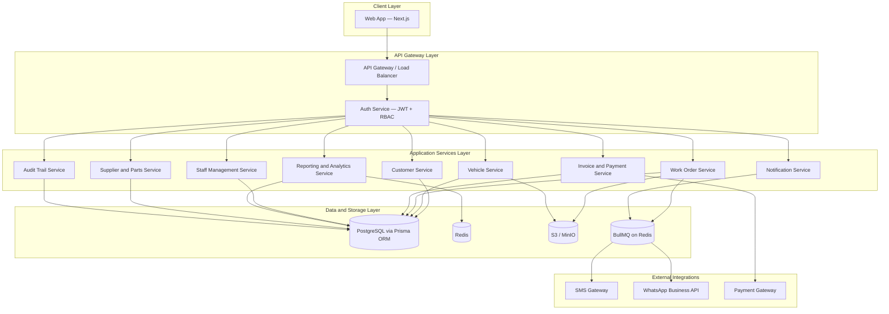
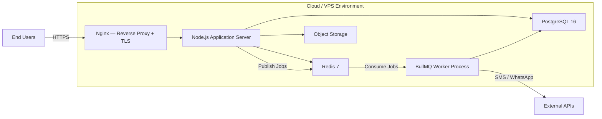
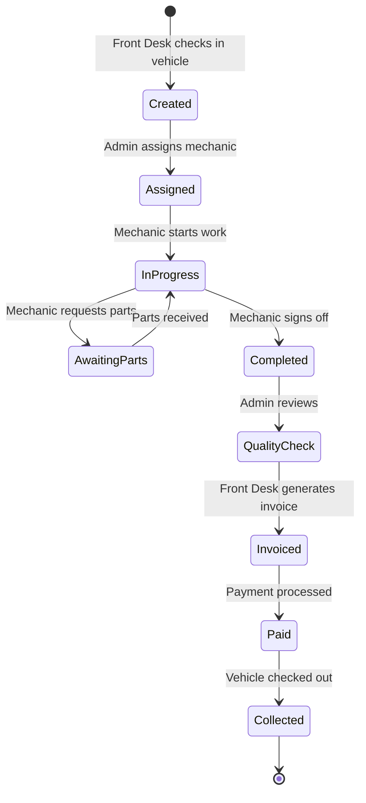
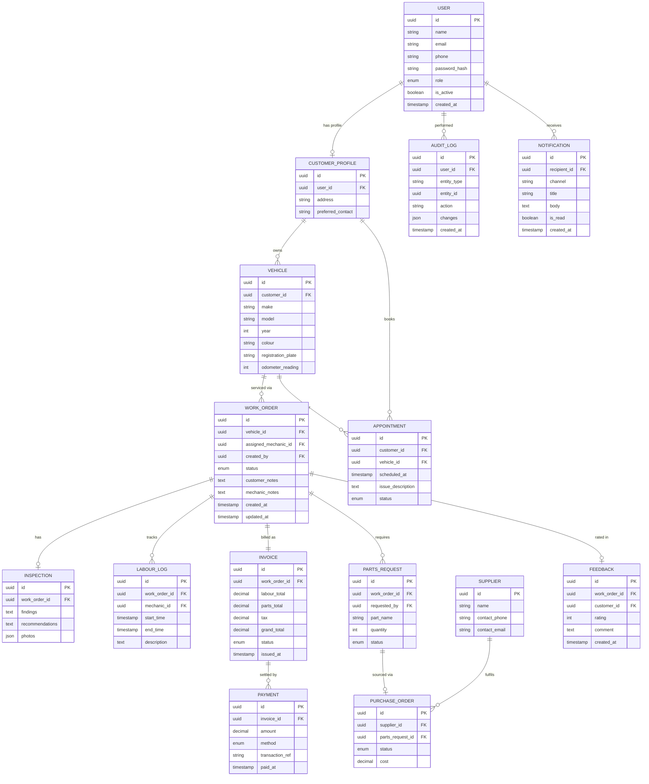
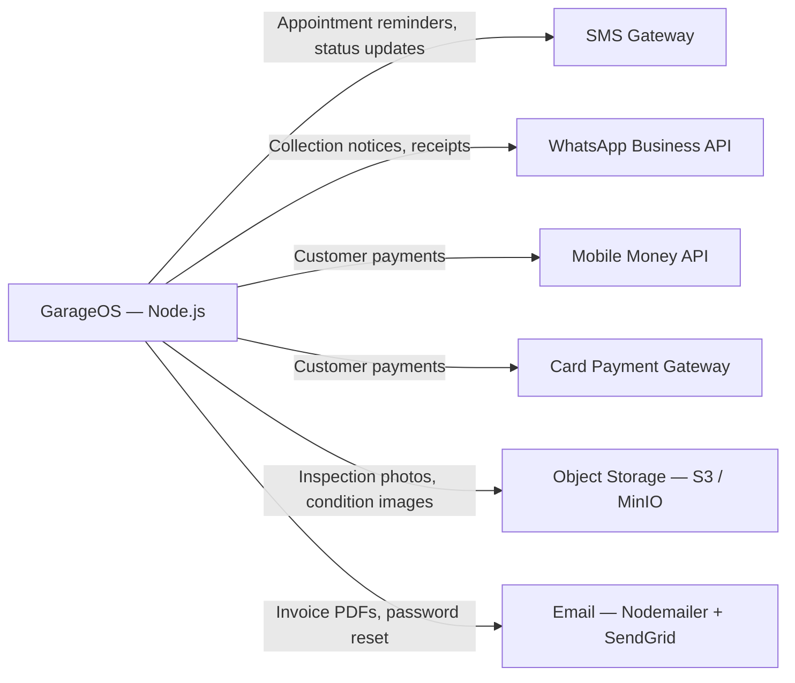
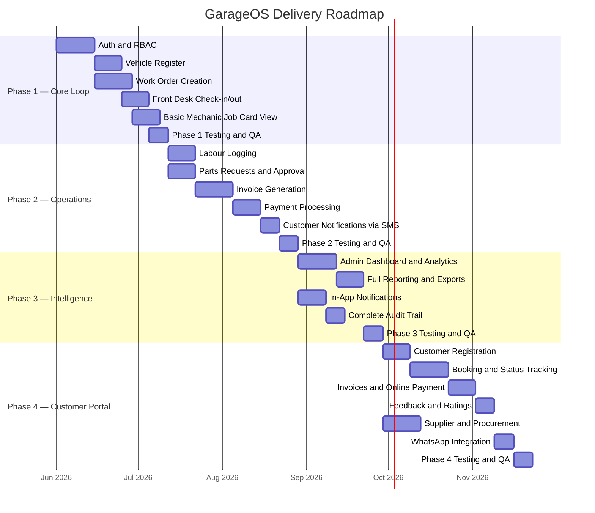

# GarageOS — Product Requirements Document
**Version:** 1.0
**Date:** 9 May 2026
**Status:** Draft — Pending Review
**Source:** [project-proposal.md](./project-proposal.md)
---
## 1. Executive Summary
GarageOS is a Garage Management System (GMS) that digitises end-to-end automotive garage operations — from customer walk-in to vehicle collection and payment. The platform replaces paper-based job cards, manual invoices, and ad-hoc communication with a single, role-aware digital workspace.
The system serves **four user roles** (Admin/Owner, Mechanic, Front Desk, Customer), each with a purpose-built interface and strict access boundaries.
### 1.1 Business Goals
| # | Goal | Success Metric |
|---|------|---------------|
| G-1 | Centralise all garage operations | 100% of jobs tracked digitally within 30 days of launch |
| G-2 | Eliminate manual paperwork | Zero paper job cards / invoices by end of Phase 2 |
| G-3 | Real-time business visibility | Admin dashboard loads KPIs in < 2 seconds |
| G-4 | Improve internal communication | Avg. job-status notification latency < 30 seconds |
| G-5 | Complete service history | Every vehicle service is searchable within 1 second |
| G-6 | Role-based access control | Zero cross-role data leakage (verified by automated tests) |
---
## 2. System Architecture
### 2.1 High-Level Architecture
The system follows a **layered, modular architecture** with clear separation between the client applications, API gateway, business-logic services, and data stores.

### 2.2 Deployment Architecture

### 2.3 Work Order Lifecycle — State Machine
This is the central workflow that connects all four user roles:

---
## 3. Branding and Design Tokens

### 3.1 Brand Colors

| Token | Hex | Usage |
|-------|-----|-------|
| `--brand-primary` | `#3857A3` | Primary buttons, links, active states, navigation, headers |
| `--brand-accent` | `#EE1E24` | CTAs, alerts, urgent badges, destructive actions, highlights |

### 3.2 Extended Palette (derived from brand)

| Token | Hex | Usage |
|-------|-----|-------|
| `--primary-50` | `#EBF0F9` | Primary tinted backgrounds |
| `--primary-100` | `#C5D3EC` | Hover states, selected rows |
| `--primary-200` | `#9FB5DE` | Secondary borders |
| `--primary-500` | `#3857A3` | Base primary (same as brand) |
| `--primary-700` | `#2A4280` | Pressed states, dark mode primary |
| `--primary-900` | `#1C2D5C` | Dark backgrounds, sidebar |
| `--accent-50` | `#FDE8E8` | Warning/error backgrounds |
| `--accent-100` | `#F9BABB` | Error field borders |
| `--accent-500` | `#EE1E24` | Base accent (same as brand) |
| `--accent-700` | `#C4181D` | Pressed accent states |

### 3.3 Semantic Colors

| Token | Value | Usage |
|-------|-------|-------|
| `--color-success` | `#16A34A` | Completed jobs, paid invoices, success toasts |
| `--color-warning` | `#F59E0B` | Awaiting parts, pending approval, expiring items |
| `--color-error` | `#EE1E24` | Uses brand accent — errors, overdue invoices, rejected |
| `--color-info` | `#3857A3` | Uses brand primary — info banners, links, notifications |

### 3.4 Neutrals

| Token | Hex | Usage |
|-------|-----|-------|
| `--neutral-0` | `#FFFFFF` | Page backgrounds, cards |
| `--neutral-50` | `#F8FAFC` | Subtle backgrounds, table stripes |
| `--neutral-100` | `#F1F5F9` | Input backgrounds, dividers |
| `--neutral-300` | `#CBD5E1` | Borders, disabled states |
| `--neutral-500` | `#64748B` | Secondary text, placeholders |
| `--neutral-700` | `#334155` | Body text |
| `--neutral-900` | `#0F172A` | Headings, high-emphasis text |

### 3.5 Typography

| Token | Value |
|-------|-------|
| `--font-family` | `'Inter', system-ui, -apple-system, sans-serif` |
| `--font-heading` | `'Inter', system-ui, sans-serif` (weight 600–700) |
| `--font-mono` | `'JetBrains Mono', monospace` |

### 3.6 Role Accent Mapping

Each user role gets a subtle visual identity derived from the brand palette:

| Role | Sidebar/Header Accent | Badge Color |
|------|----------------------|-------------|
| Admin | `--primary-900` (#1C2D5C) | `--brand-primary` |
| Mechanic | `--primary-700` (#2A4280) | `--color-warning` |
| Front Desk | `--primary-500` (#3857A3) | `--color-info` |
| Customer | `--neutral-0` (#FFFFFF) | `--brand-accent` |

---
## 4. Recommended Technology Stack (JavaScript Ecosystem)
The entire system is built on a **unified JavaScript/TypeScript stack**, enabling code sharing, a single language across the team, and a consistent developer experience.
| Layer | Technology | Rationale |
|-------|-----------|-----------|
| **Language** | TypeScript | Type safety across the full stack; shared types between frontend and backend |
| **Frontend (Web)** | Next.js 14 (React) | SSR/SSG for customer portal SEO; App Router for admin dashboards; API routes for BFF |

| **Backend API** | Node.js + Fastify | High-performance HTTP server; schema-based validation; plugin architecture |
| **ORM** | Prisma | Type-safe database queries; auto-generated client; migration management |
| **Database** | PostgreSQL 16 | Relational integrity, JSON support, full-text search, mature ecosystem |
| **Cache and Queue Broker** | Redis 7 | Session store, rate limiting, and backing store for BullMQ job queues |
| **Background Jobs** | BullMQ | Robust Node.js job queue; retries, scheduling, rate limiting, dashboard UI |
| **Object Storage** | AWS S3 SDK / MinIO | Inspection photos, condition images, invoice PDFs |
| **Auth** | Passport.js + JWT (jose) | Flexible auth strategies; stateless JWT tokens with refresh rotation |
| **Validation** | Zod | Runtime schema validation; shared between frontend and backend |
| **PDF Generation** | Puppeteer / pdf-lib | Invoice and report PDF generation server-side |
| **Real-time** | Socket.io | Live job-status updates, in-app notifications |
| **Email** | Nodemailer + SendGrid | Transactional emails (invoices, password reset) |
| **Testing** | Vitest + Playwright | Unit/integration tests (Vitest); E2E browser tests (Playwright) |
| **Monorepo** | Turborepo | Shared packages (types, utils, validation schemas) across web and API |
| **CI/CD** | GitHub Actions | Automated testing, linting, type checking, deployment |
| **Hosting** | AWS / DigitalOcean / Hetzner | Cost-effective VPS or managed services |
| **Monitoring** | Grafana + Prometheus + prom-client | Node.js metrics, alerting, uptime tracking |
| **Logging** | Pino | Structured JSON logging; fast; native to Fastify |
### 3.1 Monorepo Structure
```
garage-os/
├── apps/
│   ├── web/              # Next.js — Admin, Front Desk, Customer portal

│   └── api/              # Fastify — REST API server
├── packages/
│   ├── shared-types/     # TypeScript interfaces and enums (shared)
│   ├── validation/       # Zod schemas (shared between frontend and API)
│   ├── db/               # Prisma schema, client, and migrations
│   └── config/           # Shared ESLint, Prettier, TSConfig
├── workers/
│   └── queue/            # BullMQ worker processes
├── turbo.json
├── package.json
└── prd.md
```
---
## 4. Data Model
### 4.1 Entity-Relationship Diagram

---
## 5. Functional Requirements
### 5.1 Admin / Owner
| ID | Feature | Description | Priority |
|----|---------|-------------|----------|
| A-01 | Dashboard and Analytics | Real-time KPIs: revenue, completed/pending jobs, mechanic utilisation. Visual charts with date-range filtering. | P0 |
| A-02 | Staff Management | CRUD staff accounts, assign roles, manage shifts, track attendance, view per-employee performance summaries. | P0 |
| A-03 | Finance and Billing | Revenue overview, outstanding invoices, daily/monthly summaries, record expenses, generate tax reports. | P1 |
| A-04 | Service Catalogue | Define offered services, set standard prices, categorise types (mechanical, electrical, body work). | P1 |
| A-05 | Reports and Exports | Generate PDF/Excel reports on jobs, revenue, customer history, staff performance over any date range. | P2 |
| A-06 | System Settings | Configure garage details, manage roles/permissions, notification preferences, data backups. | P1 |
| A-07 | Work Order Assignment | Assign incoming work orders to available mechanics based on workload/speciality. | P0 |
| A-08 | Parts Approval | Review and approve/reject parts requests submitted by mechanics. | P1 |
### 5.2 Mechanic
| ID | Feature | Description | Priority |
|----|---------|-------------|----------|
| M-01 | Job Card View | View assigned job cards with vehicle details, customer notes, requested service, and status. | P0 |
| M-02 | Status Updates | Update job status (In Progress, Awaiting Parts, Complete). | P0 |
| M-03 | Inspection and Diagnosis | Record faults, recommended repairs, upload supporting photos. Visible to front desk and admin. | P0 |
| M-04 | Parts Request | Submit parts requests routed to admin for approval. | P1 |
| M-05 | Labour Logging | Log start/end time and description per job for billing accuracy. | P1 |
| M-06 | Vehicle History | View full service history of a vehicle currently in the workshop. | P1 |
| M-07 | Job Completion and Sign-off | Mark job complete, add final notes/recommendations, submit for quality check. | P0 |
### 5.3 Front Desk
| ID | Feature | Description | Priority |
|----|---------|-------------|----------|
| F-01 | Customer Management | Register new customers, search/view profiles, linked vehicles, and service history. | P0 |
| F-02 | Appointment Booking | Schedule by date/time, daily/weekly calendar view, reschedule/cancel with auto-notifications. | P0 |
| F-03 | Vehicle Check-in/out | Log arrival (make, model, reg plate, odometer, condition photos). Mark collected on departure. | P0 |
| F-04 | Invoice Generation | Generate itemised invoices (labour + parts + tax). Print or export as PDF. | P0 |
| F-05 | Payment Processing | Record cash / mobile money / bank transfer payments. Issue receipts, update status to Paid. | P0 |
| F-06 | Customer Notifications | Send auto/manual alerts via SMS or WhatsApp — reminders, status updates, collection notices. | P1 |
### 5.4 Customer — Self-Service Portal
| ID | Feature | Description | Priority |
|----|---------|-------------|----------|
| C-01 | Account Registration and Profile | Sign up, update profile, manage credentials. | P2 |
| C-02 | Vehicle Management | Register vehicles (make, model, year, colour, reg plate) under their account. | P2 |
| C-03 | Appointment Booking | Browse slots, book service, select vehicle, describe issue, receive confirmation. | P2 |
| C-04 | Service Status Tracking | Real-time job status with push/SMS notifications on changes. | P2 |
| C-05 | Service History | Full history per vehicle — dates, work performed, parts, mechanic notes. | P2 |
| C-06 | Invoice and Payment | View/download invoices, pay online (mobile money / card), view receipts and balances. | P2 |
| C-07 | Feedback and Ratings | Rate completed service (1-5 stars), optional comment. Visible to admin. | P3 |
### 5.5 Shared / Cross-Cutting
| ID | Feature | Description | Priority |
|----|---------|-------------|----------|
| S-01 | Authentication and Access Control | JWT-based auth, RBAC, password reset, session management. | P0 |
| S-02 | Vehicle Register | Central database linked to customers and job history. | P0 |
| S-03 | Work Order Lifecycle | End-to-end state machine (see section 2.3). | P0 |
| S-04 | Audit Trail | Every action logged with user, timestamp, and change description. | P1 |
| S-05 | In-App Notifications | Internal alerts for role-relevant events (job assigned, job completed, etc.). | P1 |
| S-06 | Supplier and Parts Procurement | Supplier directory, purchase orders, stock-level reorder alerts. | P2 |
---
## 6. API Design Overview
The backend exposes a **RESTful JSON API** via Fastify:
| Resource Group | Base Path | Key Endpoints |
|---------------|-----------|---------------|
| Auth | `/api/v1/auth` | `POST /login`, `POST /register`, `POST /refresh`, `POST /forgot-password` |
| Users | `/api/v1/users` | CRUD, `GET /me`, `PATCH /me` |
| Customers | `/api/v1/customers` | CRUD, `GET /:id/vehicles`, `GET /:id/history` |
| Vehicles | `/api/v1/vehicles` | CRUD, `GET /:id/work-orders` |
| Work Orders | `/api/v1/work-orders` | CRUD, `PATCH /:id/status`, `GET /:id/inspection`, `GET /:id/labour` |
| Inspections | `/api/v1/inspections` | Create, update, upload photos |
| Labour Logs | `/api/v1/labour-logs` | CRUD (scoped to mechanic) |
| Parts Requests | `/api/v1/parts-requests` | Create, approve/reject, fulfil |
| Invoices | `/api/v1/invoices` | Create, `GET /:id/pdf`, `PATCH /:id/status` |
| Payments | `/api/v1/payments` | Create, `GET /by-invoice/:id` |
| Appointments | `/api/v1/appointments` | CRUD, `GET /available-slots` |
| Suppliers | `/api/v1/suppliers` | CRUD |
| Purchase Orders | `/api/v1/purchase-orders` | CRUD |
| Reports | `/api/v1/reports` | `GET /revenue`, `GET /jobs`, `GET /staff-performance` |
| Notifications | `/api/v1/notifications` | `GET /`, `PATCH /:id/read` |
| Audit Logs | `/api/v1/audit-logs` | `GET /` (admin only) |
> **Note:** All endpoints require a valid JWT in the `Authorization: Bearer <token>` header, except `/auth/login` and `/auth/register`. RBAC middleware enforces per-endpoint role checks.
---
## 7. Non-Functional Requirements
### 7.1 Performance
| Metric | Target |
|--------|--------|
| API response time (p95) | < 300 ms |
| Dashboard load time | < 2 seconds |
| Database query time (p95) | < 100 ms |
| Concurrent users | 100+ simultaneous |
| File upload (photos) | < 5 seconds for 10 MB |
### 7.2 Security
| Requirement | Implementation |
|-------------|---------------|
| Authentication | JWT with short-lived access tokens (15 min) + refresh tokens (7 days) |
| Authorisation | Role-Based Access Control enforced at Fastify middleware layer |
| Data encryption | TLS 1.3 in transit; AES-256 at rest for sensitive fields |
| Password storage | bcrypt with cost factor >= 12 |
| Input validation | Zod schemas on all endpoints; Prisma parameterised queries |
| Rate limiting | @fastify/rate-limit — 100 req/min per user; 10 req/min on auth |
| Audit logging | All state-changing operations logged with user identity and timestamp |
| CORS | @fastify/cors restricted to known frontend origins |
### 7.3 Scalability and Reliability
| Requirement | Approach |
|-------------|----------|
| Horizontal scaling | Stateless Node.js servers behind Nginx load balancer |
| Database scaling | Read replicas for reporting queries; Prisma connection pooling |
| Background jobs | BullMQ workers for notifications, PDF generation, report building |
| Data backup | Automated daily PostgreSQL backups with 30-day retention |
| Uptime target | 99.5% availability |
| Disaster recovery | RTO < 4 hours, RPO < 1 hour |
### 7.4 Usability
| Requirement | Detail |
|-------------|--------|
| Responsive design | Fully functional on desktop (1024px+) and tablet (768px+); mobile-friendly at 360px+ |
| Offline capability | Service worker caches current job cards for offline viewing (PWA) |
| Accessibility | WCAG 2.1 AA compliance |
| Localisation | English (default); next-intl for future i18n support |
| Onboarding | In-app walkthrough for first-time users per role |
---
## 8. Integration Points

| Integration | Purpose | Trigger |
|-------------|---------|---------|
| SMS Gateway | Appointment reminders, job status updates, collection notices | Work order status change, appointment T-24h |
| WhatsApp Business API | Rich notifications with images/documents | Same as SMS (customer preference) |
| Mobile Money (MTN, Airtel) | Customer self-service payments | Customer initiates payment via portal |
| Card Payment Gateway | Online card payments | Customer initiates payment via portal |
| Object Storage | Store inspection photos, condition images, invoice PDFs | Photo upload, invoice generation |
| Email / SMTP | Password reset, invoice delivery, system alerts | Auth flow, invoice creation |
---
## 9. Delivery Roadmap

| Phase | Focus | Key Deliverables | Est. Duration |
|-------|-------|-----------------|---------------|
| **1 — Core Loop** | Foundation | Auth, vehicle register, work order CRUD, check-in/out, basic job card | ~9 weeks |
| **2 — Operations** | Business ops | Labour logging, parts requests, invoicing, payments, SMS notifications | ~8 weeks |
| **3 — Intelligence** | Insights | Dashboard, reports/exports, in-app notifications, audit trail | ~7 weeks |
| **4 — Customer Portal** | Self-service | Customer portal, online payments, feedback, supplier module, WhatsApp | ~9 weeks |
---
## 10. Risks and Mitigations
| Risk | Impact | Likelihood | Mitigation |
|------|--------|-----------|------------|
| SMS/WhatsApp API downtime | Missed customer notifications | Medium | BullMQ retry with exponential backoff; fallback channel |
| Mobile money payment failures | Revenue delay | Medium | Webhook-based reconciliation; manual payment recording fallback |
| Data loss | Critical | Low | Daily automated backups, WAL archiving, tested restore procedures |
| Scope creep across phases | Schedule delay | High | Strict phase boundaries; change requests require formal approval |
| Low mechanic adoption | Incomplete data | Medium | Simplified responsive web UI; in-person training; PWA offline support |
| Security breach | Reputation / legal | Low | Pen testing before launch; OWASP Top 10 compliance; audit logging |
---
## 11. Acceptance Criteria — Definition of Done
Each feature is considered complete when:
1. Functional requirements are implemented and pass Vitest unit/integration tests
2. API endpoints return correct responses for valid and invalid inputs
3. RBAC is enforced — no cross-role data access
4. UI is responsive on desktop (1024px and above), tablet (768px+), and mobile-friendly (360px+)
5. All state-changing actions are recorded in the audit log
6. Code is reviewed and merged via pull request
7. No critical or high-severity bugs remain open
8. Playwright E2E tests pass for critical user flows
9. Documentation (API docs, user guide) is updated
---
## 12. Open Questions
> **Important — the following items need stakeholder input before finalising:**
1. **Hosting environment** — Cloud provider preference? Budget constraints for VPS/managed services?
2. **PWA scope** — Should the web app be installable as a PWA from Phase 1 for mechanic workshop use?
3. **Payment providers** — Which specific mobile money providers should be integrated (MTN MoMo, Airtel Money, etc.)?
4. **SMS provider** — Africa's Talking, Twilio, or another regional provider?
5. **Multi-garage support** — Should the system support multiple garage branches under one account, or is single-garage sufficient for v1?
6. **Data retention policy** — How long should audit logs and service history be retained?
7. **Compliance requirements** — Are there local data protection regulations (e.g., Uganda's Data Protection Act) that must be addressed?
---
*This document is derived from the [Garage Management System Proposal](./project-proposal.md) dated 8 May 2026. It expands the proposal into a technical product requirements specification suitable for driving development.*
